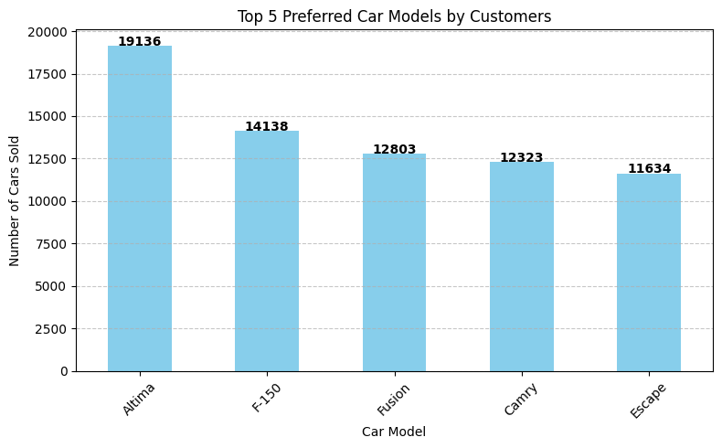
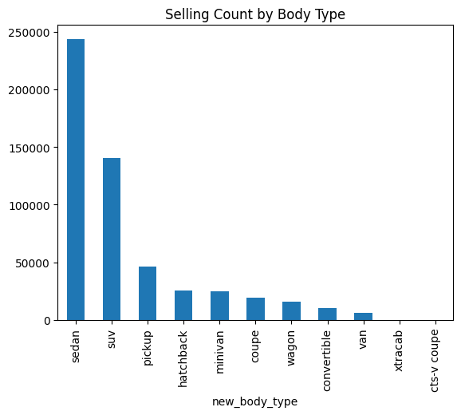
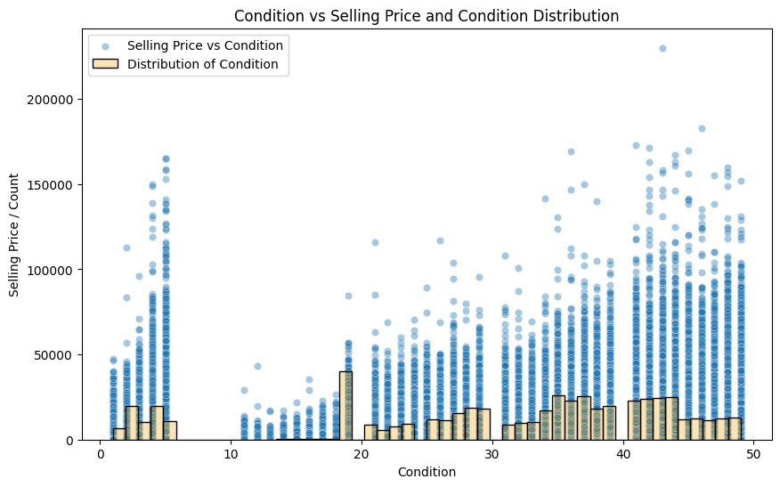
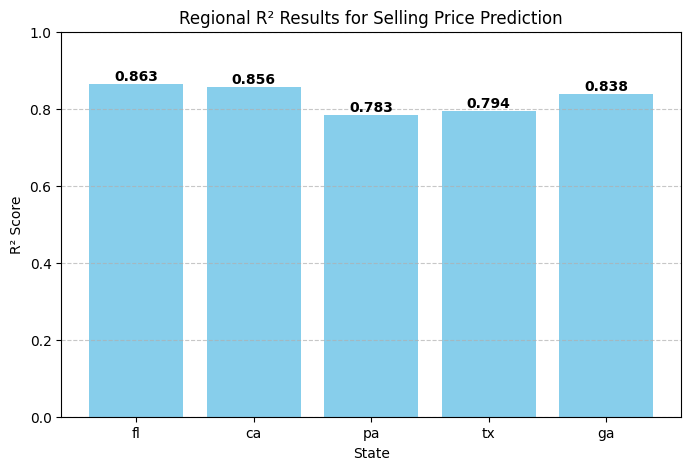

# Car Sales Analysis

## Project Overview
This project analyzes a dataset of car sales, including car models, selling prices, and market prices (MMR).  
The analysis helps a **car dealership sales manager** understand customer preferences, optimize inventory, and identify potential profit margins.

---

### Data Cleaning & Transformation
https://github.com/azwan-95/my_portfolio/blob/main/Car%20sales/car_prices.csv/data.py

---

### Cleaned Data
https://github.com/azwan-95/my_portfolio/blob/main/Car%20sales/car_prices.csv/df_clean_new.csv

---

## Dataset Description

| Column | Description |
|--------|-------------|
| **Year** | Vehicle manufacturing year (e.g., 2015) |
| **Make** | Brand or manufacturer (e.g., Kia, BMW, Volvo) |
| **Model** | Specific model (e.g., Sorento, 3 Series, S60) |
| **Trim** | Version or option package (e.g., LX, 328i SULEV) |
| **Body** | Vehicle body type (e.g., SUV, Sedan) |
| **Transmission** | Transmission type (e.g., Automatic) |
| **VIN** | Unique vehicle identifier |
| **State** | Registration state (e.g., CA for California) |
| **Condition** | Vehicle condition rating (numeric, e.g., 5.0) |
| **Odometer** | Mileage in kilometers |
| **Color** | Exterior color |
| **Interior** | Interior color |
| **Seller** | Selling entity or company |
| **MMR** | Manheim Market Report price |
| **Selling Price** | Actual sale price |
| **Sale Date** | Date and time of sale |

---

## Business Questions

### Customer Preferences
1. Which car models are most preferred by customers?  
2. Does preference for car models differ by state?  
3. Does body type affect sales count?  

### Vehicle Attributes and Purchase Behavior
4. Does odometer reading influence purchasing decisions?  
5. Does condition affect sales?  

### Profitability
6. Which vehicles have the largest profit margin (`MMR - Selling Price`)?

---

## Data Cleaning and Preparation
- Removed low-information columns (`transmission`) and handled missing values.  
- Removed duplicates and converted `Sale Date` to datetime format.  
- Removed impossible/unrealistic values (e.g., sale before manufacturing).  
- Handled odometer outliers using age-based thresholds.  
- Standardized `Body` into categories: Sedan, SUV, Pickup, Coupe, Hatchback, Wagon, Van, Minivan, Convertible.

---

## Key Findings
- **Top 5 car models sold:** Altima, F-150, Fusion, Camry, Escape.  
- **State variation:** Customer model preference differs significantly by state.  
- **Top 3 body types sold:** Sedan (45%), SUV (26%), Pickup (8%).  
- **Odometer effect:** Lower mileage cars sell faster and at higher prices.  
- **Condition effect:** Higher condition scores correlate with higher selling prices.  
- **Profitability insight:** Certain makes consistently yield high positive margins, indicating potential for profitable resale.

---

## Machine Learning: Selling Price Prediction
- **Objective:** Predict selling price to support inventory and pricing decisions.  
- **Model:** Random Forest Regressor using features: `Odometer`, `Condition`, `Body Type`, `Model`.  
- **Encoding:** One-hot encoding for categorical features.  
- **Split:** 80/20 train-test split.  

**Performance:**
- Training R²: 0.9801  
- Test R²: 0.8662  

**Regional Analysis (Top 5 states):**  

| State | R² Score |
|-------|----------|
| FL    | 0.863    |
| CA    | 0.856    |
| PA    | 0.783    |
| TX    | 0.794    |
| GA    | 0.838    |

---

## Model-Specific Linear Regression Insights

| Model   | Regression Equation | R² Train | R² Test |
|---------|-------------------|-----------|---------|
| Altima  | y = 13,457.78 - 0.07(Odometer) + 67.84(Condition) - 556.01(Sedan) | 0.754 | 0.739 |
| F-150   | y = 24,542.37 - 0.12(Odometer) + 94.60(Condition) | 0.558 | 0.566 |
| Fusion  | y = 14,775.00 - 0.10(Odometer) + 65.20(Condition) | 0.674 | 0.670 |
| Camry   | y = 13,066.86 - 0.07(Odometer) + 76.07(Condition) + 226.01(Sedan) - 138.74(Wagon) | 0.808 | 0.816 |
| Escape  | y = 17,880.19 - 0.11(Odometer) + 60.18(Condition) | 0.606 | 0.739 |
| Focus   | y = 9,476.78 - 0.07(Odometer) + 54.25(Condition) + 1,994.77(Hatchback) + 1,280.67(Sedan) + 407.63(Wagon) | 0.704 | 0.703 |
| Astra   | y = 6,160.32 - 0.04(Odometer) + 36.86(Condition) | 0.531 | 0.586 |

**Insights:**  
- **Odometer:** Higher mileage reduces selling price.  
- **Condition:** Better condition increases price.  
- **Body type:** Effects vary; Hatchback/Sedan often increase price, Wagon may reduce it.  
- Model-specific equations allow **tailored pricing strategies**.

---

## Visualizations

### Top 5 Car Models Sold

### Selling Count by Body Type

### Odometer vs Selling Price

### Condition vs Selling Price

### Regression Coefficients by Model

---

## Tools and Libraries
- **Python:** Data analysis and modeling  
- **Pandas:** Data cleaning and manipulation  
- **Matplotlib / Seaborn:** Visualization  
- **Scikit-learn:** Machine learning (Random Forest, Linear Regression)  

---

## Summary
This analysis provides actionable insights for car dealerships:  
- Understand customer model and body type preferences by state.  
- Quantify the impact of vehicle attributes (odometer, condition) on selling price.  
- Forecast selling prices and potential profit margins to optimize inventory and pricing.  
- Model-specific regressions support **data-driven pricing decisions** for each car model.  

**Outcome:** Improved decision-making, enhanced profitability, and actionable insights for sales managers.
